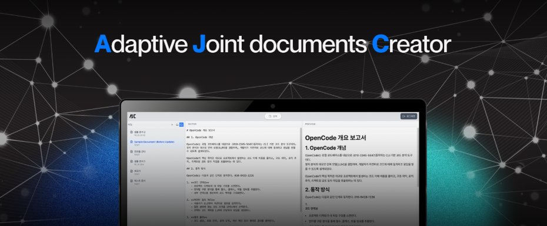
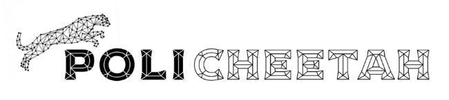
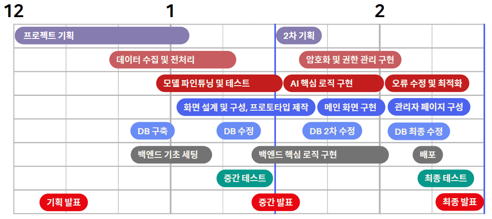
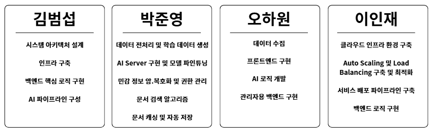
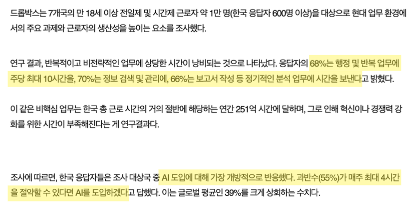
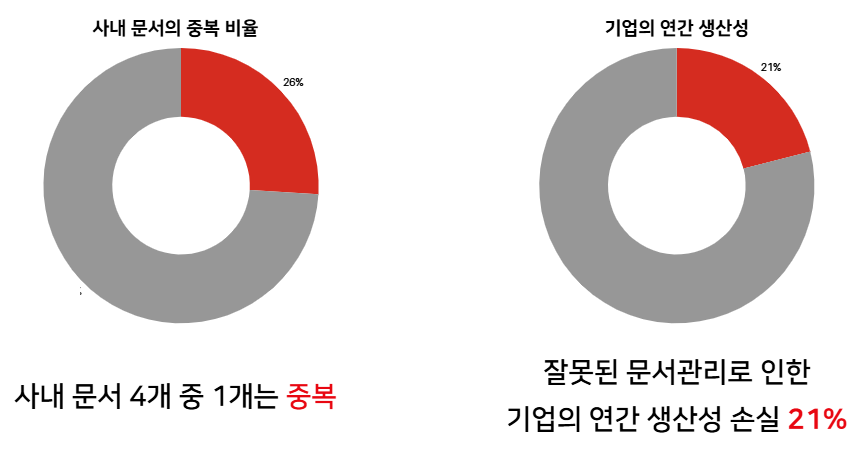
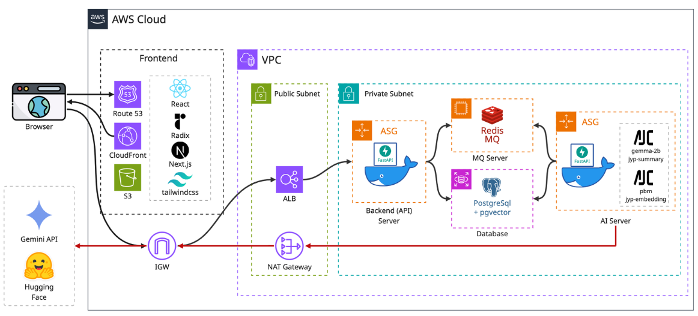

<!--  -->

# SKN19-Final-3Team: AJC - AI 기반 적응형 문서 생성 시스템

<div align="center">



**Update Once. Sync Everywhere.**

</div>

---

## 목차
- [팀 소개](#팀-소개)
- [프로젝트 개요](#프로젝트-개요)
- [데이터 분석](#데이터-분석)
- [모델링 및 결과](#모델링-및-결과)
- [산출물](#산출물)
- [프로젝트 구조](#프로젝트-구조)
- [실행 방법](#실행-방법)
- [팀 회고](#팀-회고)

---

## 팀 소개

<div align="center">

</div>

### 1. 팀 구성원

<div align="center">

| 김범섭 | 박준영 | 오하원 | 이인재 |
| :---: | :---: | :---: | :---: |
|  |  |  |  |  |
| [](https://github.com/WhatSupYap) | [](https://github.com/deneb784) | [](https://github.com/Hawon-Oh) | [](https://github.com/distecter)|
| **백엔드** | **AI/ML** | **프론트엔드** | **시스템** |
</div>

### 2. WBS
**프로젝트 기간**: 2025.12.16 ~ 2026.02.11 (8주)
<div align="center">

</div>

### 3. 기여한 일
<div align="center">

</div>

---

## 프로젝트 개요

### 1. 문제 정의

#### 반복적인 문서 관리에 의한 피로도와 생산성 손실
<div align="center">
    
    <div align="right">
    출처: 한경매거진(2025)
    </div>
    <br/>
    
    <div align="right">
    출처: IDC(2025)
    </div>
</div>


### 2. sLLM을 활용한 문서 관리 툴의 필요성
- **지식 관리 난이도**: 기존엔 지식 정보들이 산발적으로 펴져있기에 **동기성을 유지**하는 것이 어려웠음

- **문서 보안 이슈**: LLM 기능을 사용하려면 중요 문서 내용이 **유출 또는 공유**돼 왔음

- **고비용**: 매번 문서 관리하는데 LLM을 사용하기엔 **비용과 시간**이 많이 듦

### 3. 프로젝트 목표
반복되는 **문서 작업의 비효율**을 줄이고자, sLLM 기술을 활용해 문서들의 내용을 분석하며 자동으로 문서들을 **병합 및 최신화**한다. 한 곳의 문서에서 수정이 됐을 시, 같은 내용을 포함하고 있는 문서에도 **자동으로 수정사항이 적용**된다.

### 4. 기대 효과
- 문서 작업의 간편화와 효율화
- 지식 관리 자동화
- 민감정보 암호화 및 문서 보안


### 5. 시연 영상
- 메인기능 + 검색
- 관리자 기능

---

## 시스템 아키텍처
<div align="center">

</div>

---

## 기술 스택

#### 언어


<!--  -->

#### 개발 도구


#### 프론트엔드


#### 백엔드


#### AI/ML


#### AWS 인프라


---

## 데이터 수집&전처리 및 파인튜닝

```
[데이터 수집 및 활용의 적법성 검토]
- 저작권 준수: 해당 데이터의 이용약관을 검토하여 상업적 이용 및 2차 가공 가능 여부를 확인하였습니다.
- 크롤링 이용약관 준수: Robots.txt 규정에 따라 서버에 부하를 주지 않는 방식으로 크롤링을 수행하였습니다.
- 개인정보 보호: 수집 과정에서 개인 식별 정보(이름, 연락처 등)는 즉시 제외하거나 비식별 처리를 완료하였습니다.
```

### 1. 데이터 수집 및 전처리

**데이터 출처**: 자체 생성 및 Github 오픈소스 문서
- **수집 대상**: IT 용어가 포함되고 주제별로 구분된 문서
- **수집 기간**: 2025년 12월 20일 ~ 2025년 12월 24일
- **수집 데이터**: 123MB 크기의 문서 데이터

**데이터 전처리**
- **민감 정보 마스킹**: HTML, 민감정보(이름, 숫자 등)을 대체어로 변경
- **최종 분석 대상**: OpenAI API로 요약 문장 생성
- **전처리 후**: 6000개의 문장 쌍 (긴 문장 - 요약)

### 2. 모델 선정

#### 요약 모델(Student) 선정

| 모델명                                          | 종류   | 결과      | 비고             |
| -------------------------------------------- | ---- | ------- | -------------- |
| google/gemma-2-2b-it                         | sLLM | 최종 선정 | Gemma 9B 모델 성능 우수 |
| Qwen/Qwen3-1.7B                              | sLLM | 후보      | 경량 모델          |
| SEOKDONG/llama3.2_1B_korean_v0.2_sft_by_aidx | sLLM | 후보      | 한국어 특화         |
| upstage/SOLAR-10.7B-Instruct-v1.0            | sLLM | 후보      | 대형 모델          |

#### 임베딩 모델 선정 (Semantic 청크용과 RAG용 각각 1개씩 선정)

| 모델명                                    | 종류     | 결과      | 비고        |
| -------------------------------------- | ------ | ------- | --------- |
| sentence-transformers/all-MiniLM-L6-v2 | 임베딩 모델 | 최종 선정 | 경량, 빠른 추론 |
| OpenAI Embedding Model                 | 임베딩 모델 | 최종 선정 | 외부 API 기반 |


 2. Teacher 모델 선정
   ↓ google/gemma-2-9b-it
 
 3. 지식증류(Distillation) 학습
   ↓ 2B Student 모델 생성

 4.  Student 모델 평가
   ↓ 결과


### 3. 임베딩 모델 파인튜닝 과정

 1. Positive-Negative 데이터셋 준비
   ↓ 2,000개 쌍의 데이터
 
 2. Base 모델 선정
   ↓ google/gemma-2-9b-it
 
 3. Metric 학습
   ↓ 

 4.  Student 모델 평가
   ↓ 결과


### 4. 모델 성능 평가

<div align="center">

|  | GPT-4i-mini (API) | gemma-2-9b-it | 자체 2B 모델 |
|---|---|---|---|
**RougeL**| 0.38점 | 0.47점 | 0.47점 |
**BertScore** | 0.25점 | 0.25점 | 0.!!점 |
**응답 시간** | 1.7초 | 5.6초 | 1.9초 |

</div>

---

## 디렉토리 구조

<details>
<summary><b>전체 디렉토리 구조 보기</b></summary>

```bash
AJC:
├─assets
│  └─images
├─backend
│  ├─ai_server
│  │  └─app
│  │      ├─data
│  │      ├─model_data
│  │      └─modules
│  ├─api_server
│  │  └─app
│  │      └─api
│  │      └─services
│  └─common
│      └─core
│      └─repositories
│      └─util
├─data
│  ├─fine-tuning
│  ├─modules
│  └─test_data
├─database
├─docs
│  ├─demo
│  └─readme
│
├─frontend
│  ├─app
│  │  ├─admin
│  │  │  ├─audit-logs
│  │  │  ├─categories
│  │  │  ├─permissions
│  │  │  ├─regex
│  │  │  └─users
│  │  ├─login
│  │  ├─main
│  │  ├─merge
│  │  └─register
│  ├─components
│  │  ├─admin
│  │  └─ui
│  ├─hooks
│  ├─lib
│  │  └─api
│  ├─node_modules
│  ├─public
│  └─styles
└─samples
```

</details>

---

## 실행 방법

### 1. 환경 설정 및 실행법

```bash
# 저장소 클론
git clone https://github.com/your-repo/SKN19-Final-3Team.git

# 도커 세팅법은 docs/도커_세팅법.md 참조 이후 도커 컨테이너 실행

# API서버 가상환경 생성 및 활성화
conda create -n AJC_api python=3.10
conda activate AJC_api

# API서버 라이브러리 설치
cd SKN19-Final-3Team/backend/api_server
pip install -r requirements.txt

# AI서버 가상환경 생성 및 활성화
conda create -n AJC_ai python=3.10
conda activate AJC_ai

# AI서버 라이브러리 설치
cd ../ai_server
pip install -r requirements.txt

# 프론트엔드 라이브러리 설치
cd ../../frontend
npm install

# .env 파일 설정
.env.local 파일 생성 후 환경 변수 설정 (변수 설정은 .env.example 참조)

# Frontend 실행
Frontend: npm run dev

# Backend 실행
Backend: uvicorn app.main:app --host [IP_ADDRESS] --port 8000 --reload
또는, 디버깅 툴로 "Backend + Worker 동시 실행" 옵션 선택 후 실행

```

---

## 트러블슈팅

<details>
<summary><b>1. HTTPS Mixed Content 오류</b></summary>

### 문제
- CloudFront(HTTPS)로 배포된 프론트엔드에서 ALB(HTTP)로 API를 호출하자 브라우저에서 Mixed Content 오류가 발생하며 요청이 차단됨.

### 원인
- HTTPS 페이지에서 HTTP 리소스를 호출했기 때문
- 브라우저 보안 정책상 암호화되지 않은 요청은 자동 차단됨
- 코드 문제가 아닌 인프라 프로토콜 불일치 문제

### 해결
- ALB에 HTTPS 리스너 추가 결정
- 도메인 필요 → Route 53에서 도메인 구입
- ACM에서 SSL 인증서 발급
- 인증서 리전 문제 발생
- CloudFront는 Global 서비스(CloudFront용 인증서는 반드시 **us-east-1(버지니아 북부)**에서 발급해야 함)
- ALB는 배포 리전(서울 ap-northeast-2) 인증서 필요
- 리소스별로 다른 리전 인증서 적용
- Route 53에서 레코드 매핑 후 HTTPS 정상 동작

### 교훈

- AWS 서비스마다 인증서 요구 리전이 다름
- 브라우저 보안 정책이 인프라 구조에 직접적인 영향을 준다는 점 체감
</details>

<details>
<summary><b>2. sLLM 요약 모델의 성능 저하</b></summary>

### 문제

- 문서 데이터셋에 다음과 같은 요소들이 포함되어 있었음.
HTML 태그, 문서 번호 (ex. 제1조, 1.1.3 등), 개인 이름, 조직명 등 불필요한 메타데이터

- 모델이 불필요한 패턴을 학습, 비슷하지만 잘못된 숫자나 단어를 생성하는 문제 발생

### 원인

- Distillation 과정에서 Teacher 모델이 출력한 요약을 그대로 정답으로 사용했기 때문.

- Teacher는 비교적 강건했지만, Student는 표면 패턴에 과적합. 의미보다 형식(HTML, 번호)을 우선 학습. 특히 작은 sLLM은 포맷 노이즈에 더 취약했음.

### 해결

- 전처리 단계에서 HTML 태그 제거 및 불필요한 메타데이터 마스킹, 개인정보·고유명사 일반화 처리

- Teacher 출력도 재정제 후 distillation 데이터로 사용

### 교훈

- Distillation은 데이터 품질 영향이 훨씬 큼

- 작은 모델일수록 형식적 패턴에 쉽게 과적합

</details>

---

## 향후 개선 방향
### 1. 멀티모달 대응 및 포맷 확장

- MarkDown 문서 이외에도 OCR 및 레이아웃 분석을 통해 PDF, DOCX, 이미지 기반 문서 등 다양한 문서 포맷을 자동 파싱하여 의미 단위(Section) 기준으로 구조화하여 동일한 관리·동기화 체계에 편입

- 텍스트뿐만 아니라 이미지, 표, 다이어그램 등 비정형 데이터까지 문서 맥락에 맞게 섹션에 포함시키는 멀티모달 분석 기능 도입


### 2. 협업 생태계 구축

- 2인 이상의 사용자가 동일 문서를 실시간으로 편집할 수 있는 협업 환경 제공

- 섹션 단위 잠금, 변경 제안, 리뷰 및 승인 워크플로우 도입

- AI 기반 변경 요약 및 충돌 원인 분석을 통해 협업 시 발생하는 편집 충돌을 최소화


### 3. sLLM 고도화

- 각 문서 섹션의 핵심 의미(에센스)를 임베딩하는 기존 외부 모델 API를 대체 가능한 **자체 sLLM(Small Language Model)**로 점진적 전환

- 모델 버전 교체가 문서 인덱싱·동기화 로직에 영향을 최소화하도록 모델 추상화 계층 설계

---

## 회고

#### 김범섭
`사소한 것 하나하나 제로부터 백까지 구현해보는 경험 자체가 즐거웠습니다. 기존에 알던 전문지식들을 적극 활용해봄은 물론, 그 동안 써보고 싶던 기술스택들 또한 적극 활용해볼 수 있던 점에 커리어적으로도 개발자의 인생에서도 소중한 계절이 됐습니다.`

#### 박준영
`기존에 몰랐던 파인튜닝 기법들을 테스트 및 적용해가며 다양한 인사이트를 얻어서 좋았습니다. 복잡한 기능들이 단순히 구현한다는 것에 그치지 않고 실제로 서비스됐을 시, 정확도는 어떨지 어떤 사용자 경험을 줄 수 있을지도 복합적으로 생각해보았습니다.`

#### 오하원
`기존에 없던 서비스를 실체화하기 위해 복잡한 로직들을 구현하느라 다들 고생했습니다. 정확도-속도의 트레이드 오프를 상쇄할 알고리즘적 접근도 최대한 고민해보았습니다. 구현하지 못한 부분들에 아쉬움도 남지만, 다양한 것들을 해보며 얻어가는 것이 많은 도전적인 프로젝트가 된 것 같습니다.`

#### 이인재
`과연 실무적인 시스템이라면 어떤 디테일까지 챙겨야 할지 깊이 조사해보며 Auto Scaling, Load Balancing, 인스턴스 간의 연동 및 모듈화는 어떻게 해야할지 고민하며 하나하나 구현해보았습니다. 다음 번엔 CICD까지도 해보고 싶습니다.`

---

## 참고 자료

### 1. 산출물

<div align="center">

| 구분 | 파일명 | 설명 |
|---|---|---|
| **데이터 분석** | [ㅅ.md](docs/summary/eda/데이터전처리결과서.md) | EDA, 전처리, 가설 검증, 파생변수 |
| **모델 분석** | [인공지능학습결과서.md](docs/summary/model/인공지능학습결과서.md) | 모델 비교, 성능 평가, 선정 사유 |
| **최종 모델** | [model_train_result.pkl](notebooks/team/results/model_train_result.pkl) | CatBoost |

</div>

### 2. 기술 참조
- [Pytorch Documentation](hhttps://docs.pytorch.org/docs/stable/index.html)
- [TeddyNote 관리자 기능](https://github.com/teddynote-lab/langconnect-client/blob/main/next-connect-ui/assets/main.png)
- [AWS 및 Azure의 RAG 아키텍처 비교](https://devocean.sk.com/blog/techBoardDetail.do?ID=166765&boardType=techBlog)


---

<div align="center">

**Built with ❤️ by Poli Cheetah**

</div>
